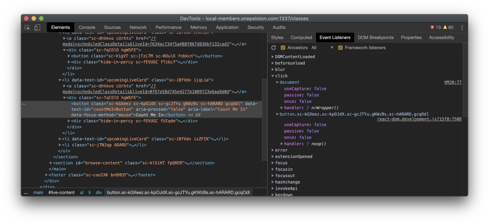

# onClick={wat}

## Let's talk about events in React

```jsx
const handler = () => alert("🙌");
const MyComponent = () => <button onClick={handler}>🔥</button>;
```

What is React actually doing with that `onClick` prop? Until _very_ recently, I think I assumed it was doing something like this:

```jsx
const el = findDomNode(this);
el.addEventListener("click", handler);
```

(or something)

If you start digging around the section on [events](https://reactjs.org/docs/events.html) in the React documentation, you will find that React uses something called `SyntheticEvent`.

> Your event handlers will be passed instances of SyntheticEvent, a cross-browser wrapper around the browser’s native event. It has the same interface as the browser’s native event, including stopPropagation() and preventDefault(), except the events work identically across all browsers.

Okay, that makes sense. What else?

> The SyntheticEvent is pooled. This means that the SyntheticEvent object will be reused and all properties will be nullified after the event callback has been invoked. This is for performance reasons. As such, you cannot access the event in an asynchronous way.

ALright. So they do that for compatability *and* performance. What's the big deal though?

Well, it's not **just** `SyntheticEvent` that's important here.

> The SyntheticEvent is pooled

By what?

Let's take a look at [react-dom](https://github.com/facebook/react/blob/66f280c87b05885ee55320a5e107a534a50f9375/packages/react-dom/src/events/ReactBrowserEventEmitter.js). Specifically:

```
/**
 * Summary of `ReactBrowserEventEmitter` event handling:
 *
 *  - Top-level delegation is used to trap most native browser events. This
 *    may only occur in the main thread and is the responsibility of
 *    ReactDOMEventListener, which is injected and can therefore support
 *    pluggable event sources. This is the only work that occurs in the main
 *    thread.
 *
 *  - We normalize and de-duplicate events to account for browser quirks. This
 *    may be done in the worker thread.
 *
 *  - Forward these native events (with the associated top-level type used to
 *    trap it) to `EventPluginHub`, which in turn will ask plugins if they want
 *    to extract any synthetic events.
 *
 *  - The `EventPluginHub` will then process each event by annotating them with
 *    "dispatches", a sequence of listeners and IDs that care about that event.
 *
 *  - The `EventPluginHub` then dispatches the events.
 *
 * Overview of React and the event system:
 *
 * +------------+    .
 * |    DOM     |    .
 * +------------+    .
 *       |           .
 *       v           .
 * +------------+    .
 * | ReactEvent |    .
 * |  Listener  |    .
 * +------------+    .                         +-----------+
 *       |           .               +--------+|SimpleEvent|
 *       |           .               |         |Plugin     |
 * +-----|------+    .               v         +-----------+
 * |     |      |    .    +--------------+                    +------------+
 * |     +-----------.--->|EventPluginHub|                    |    Event   |
 * |            |    .    |              |     +-----------+  | Propagators|
 * | ReactEvent |    .    |              |     |TapEvent   |  |------------|
 * |  Emitter   |    .    |              |<---+|Plugin     |  |other plugin|
 * |            |    .    |              |     +-----------+  |  utilities |
 * |     +-----------.--->|              |                    +------------+
 * |     |      |    .    +--------------+
 * +-----|------+    .                ^        +-----------+
 *       |           .                |        |Enter/Leave|
 *       +           .                +-------+|Plugin     |
 * +-------------+   .                         +-----------+
 * | application |   .
 * |-------------|   .
 * |             |   .
 * |             |   .
 * +-------------+   .
 *                   .
 *    React Core     .  General Purpose Event Plugin System
 */
 ```

Alright, so this is pretty complex. Really the only thing we care about here is the first sentence though:

> Top-level delegation is used to trap most native browser events.

You can see an example of this if you look at the Event Listeners panel in Chrome's devtools and inspect an item you have assigned an `onClick` handler to.



Notice that in the example above (and probably also in your own dev tools) that while there *is* an event listener attached to the button, the `handler` prop is `noop()`. Additionally, you can remove this listener (using the dev tools) and whatever you attached to `onClick` still executes when you click the button.

That's because the event listener that is executing your handler is attached to the `document` (you can validate this by removing *that* listener and noticing that your handler does **not** execute anymore).

What you are seeing here (attached to document) is the global event delegate that picks up virtually every event that can be attached via `onClick`/`onDrag`/`onFocus`/`onYouGetTheIdea`, you can see a full list [here](https://reactjs.org/docs/events.html#reference).

## Why are you telling me all of this?


