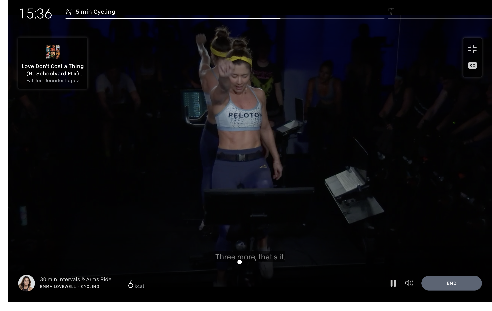

# onClick={wat}

---

👋

Drew Wyatt

Software Engineer @ Peloton

---

[@drewwyatt](#) | [@djwyatt](#)

---


# Let's talk about events in React

---

```jsx
const handler = () => alert('🙌')
const MyComponent = () => (<button onClick={handler}>🔥</button>)
```

---

```jsx

const handler = () => alert('🙌')
const MyComponent = () => (<button onClick={handler}>🔥</button>)
```
                                  ^ What does this do?

---

## What I assumed

## (until very recently)

---

```jsx
const ref = findDomNode(this)
ref.addEventListener('click', handler)
```

---

```jsx
const ref = findDomNode(this)
ref.addEventListener('click', handler)
```

(or something)

---

## Synthetic Events

---

```jsx
/*
 * Summary of `ReactBrowserEventEmitter` event handling:
 *
 *  - Top-level delegation is used to trap most native browser events. This
 *    may only occur in the main thread and is the responsibility of
 *    ReactDOMEventListener, which is injected and can therefore support
 *    pluggable event sources. This is the only work that occurs in the main
 *    thread.
 *
 *  - We normalize and de-duplicate events to account for browser quirks. This
 *    may be done in the worker thread.
 *
 *  - Forward these native events (with the associated top-level type used to
 *    trap it) to `EventPluginHub`, which in turn will ask plugins if they want
 *    to extract any synthetic events.
 *
 *  - The `EventPluginHub` will then process each event by annotating them with
 *    "dispatches", a sequence of listeners and IDs that care about that event.
 *
 *  - The `EventPluginHub` then dispatches the events.
 */
```

---

### There is also this neat graph

---

```jsx
/*
 * Overview of React and the event system:
 *
 * +------------+    .
 * |    DOM     |    .
 * +------------+    .
 *       |           .
 *       v           .
 * +------------+    .
 * | ReactEvent |    .
 * |  Listener  |    .
 * +------------+    .                         +-----------+
 *       |           .               +--------+|SimpleEvent|
 *       |           .               |         |Plugin     |
 * +-----|------+    .               v         +-----------+
 * |     |      |    .    +--------------+                    +------------+
 * |     +-----------.--->|EventPluginHub|                    |    Event   |
 * |            |    .    |              |     +-----------+  | Propagators|
 * | ReactEvent |    .    |              |     |TapEvent   |  |------------|
 * |  Emitter   |    .    |              |<---+|Plugin     |  |other plugin|
 * |            |    .    |              |     +-----------+  |  utilities |
 * |     +-----------.--->|              |                    +------------+
 * |     |      |    .    +--------------+
 * +-----|------+    .                ^        +-----------+
 *       |           .                |        |Enter/Leave|
 *       +           .                +-------+|Plugin     |
 * +-------------+   .                         +-----------+
 * | application |   .
 * |-------------|   .
 * |             |   .
 * |             |   .
 * +-------------+   .
 *                   .
 *    React Core     .  General Purpose Event Plugin System
 */
```

---

## tl;dr: it's not that simple

---

## Why does this matter?

---

## 🎉 Third party libraries 🎉

---

If you are using a third party library that attaches **native** events (i.e. events **not** handled by React's global event handler) and you need to `stopPropagation()` or `preventDefault()`, you are going to have a bad time.

---

# E.G.

---



---


This is a thing I work on

---


It uses JWPlayer (which does not use React)

---


We customized the controls

---


We use React

---


We wanted the controls to be keyboard accessible

---


JWPlayer uses spacebar and enter to

pause/play the video

---


We do not want to pause/play the video while you are trying to adjust the volume

---


🤦‍

---

# Demo
